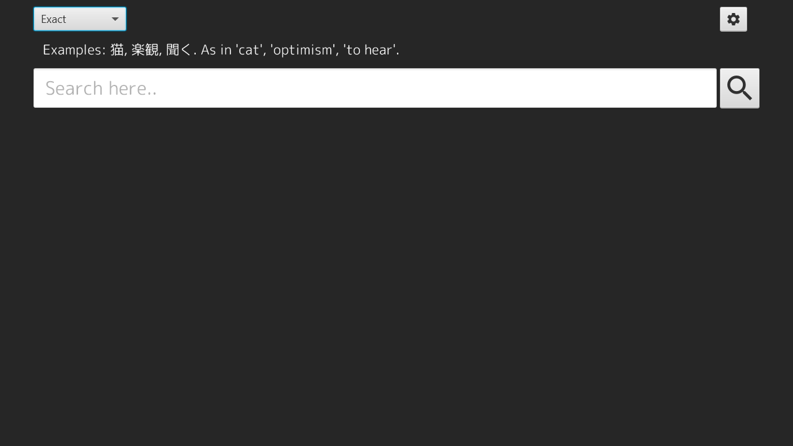

# User guide
Download the latest release in [releases](https://github.com/Luukuton/ot-harjoitustyo-hy2020/releases).

## Launching the application
This guide assumes that the application has permissions to write (create, modify) and read a file called settings.properties in the same folder where the JAR is located. 

The application can be launched by clicking the JAR file depending on the OS or entering the following command: 
```
java -jar jirin.jar
```

## Configuration
If the settings file (settings.properties) is not present in the same folder as the JAR, it will be generated on launch.

Settings can be changed through the settins button (gear icon) inside the app.

Settings view:


By changing either of the fonts and pressing the checkmark (save), the application will restart itself. By only chaning the theme, the application will not restart.

The cross cancels any changes made. By closing the settings window exhibits the same behaviour.
## Searching
Application launches to this view:



Search queries can be made by typing into the search bar and pressing enter or clicking the magnifier. Search mode can be changed by selecting a suitable one from the list.

There are three different search modes: 
* Exact
  * Query is this exact string typed into the search bar.
  * For example when searching '走る', it'll only match '走る'.
* Forward
  * Query begins with these characters. 
  * For example when searching '疑', it'll match '疑問', '疑念', '疑惑' etc.
  * In regex it'd be `/疑.*/`.
* Backward
  * Query ends with these characters. 
  * For example when searching '気', it'll match '空気', '元気', '天気' etc.
  * In regex it'd be `/.*気/`.

Search results view:


If the word or phrase searched has multiple entries (usually the case with Forward and Backward modes), they can be viewed by clicking the two arrows.

By clicking the **Web Source** link, the source of the currently shown word will be opened in the operating system's default web browser.
